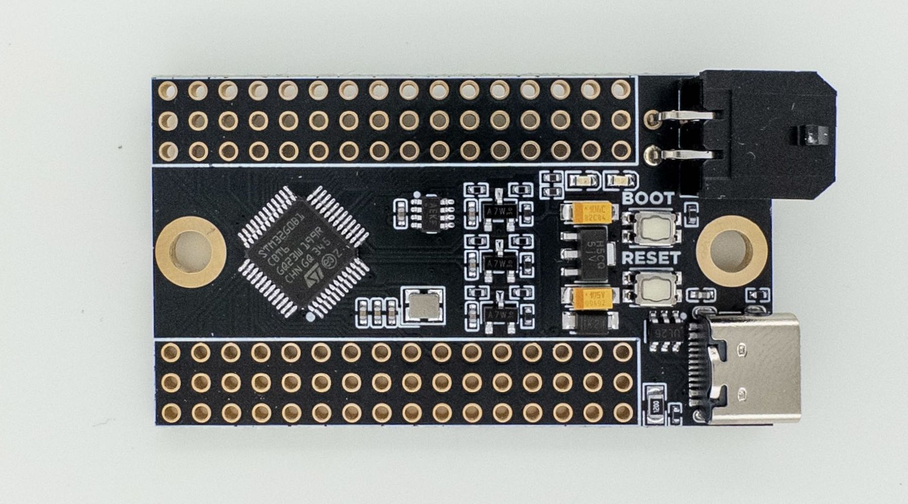

# Hedgehog

Hedgehog is a Klipper expansion PCB with 31 I/O pins, designed for cases when you just need a simple board to connect a few things to your printer, like pins for buttons, thermistors, I2C/SPI devices, etc. Hedgehog, unlike generic MCU breakout boards, is designed with ease-of-use with Klipper in mind:

- **Are you wiring a bunch of buttons and don't want to join many wires to one pin?** Hedgehog has a pair of 3.3V and GND for each pin.
- **Do you want to use CAN bus, and don't want to wire a separate CAN module?** Hedgehog has a CAN transceiver built-in, and supports both USB and CAN.
- **Do you only have 24V available where you're planning to place the board?** No problem, Hedgehog supports 24VIN.
- **Do you want to connect a few thermistors, and don't want to solder pullup resistors?** Hedgehog as pullups and protection for 3 thermistors built-in.
- **Are you designing a custom board for your application and need a simple MCU breakout board to slot into your design?** Hedgehog uses standard 2.54mm (0.1") pitch pin headers for its I/O, so you can easily slot it into standard female headers on your design.

Hedgehog uses a STM32G0B1 MCU, supporting Klipper, STM32Duino and many other firmwares.

## Purchasing a Hedgehog
- [Isik's Tech Store](https://store.isiks.tech/products/hedgehog)
- ~~[List of Resellers](https://docs.isiks.tech/Hedgehog/Hedgehog/)~~

## Documentation
[Docs](https://docs.isiks.tech/Hedgehog/Hedgehog/)

## License
This work is licensed under a
[Creative Commons Attribution-NonCommercial-ShareAlike 4.0 International License][cc-by-nc-sa].

[![CC BY-NC-SA 4.0][cc-by-nc-sa-image]][cc-by-nc-sa]

[cc-by-nc-sa]: http://creativecommons.org/licenses/by-nc-sa/4.0/
[cc-by-nc-sa-image]: https://licensebuttons.net/l/by-nc-sa/4.0/88x31.png
[cc-by-nc-sa-shield]: https://img.shields.io/badge/License-CC%20BY--NC--SA%204.0-lightgrey.svg

## Notes
- Markdown files in this repository may contain Amazon Associate, Aliexpress affiliate, PCBWay affiliate, Jawstec affiliate, Polymaker affiliate links. I make a comission on qualifying purchases.
- This project does not come with any warranty, if you choose to build/use a PCB manufactured using published files in this repository, you are doing this at your own risk!
